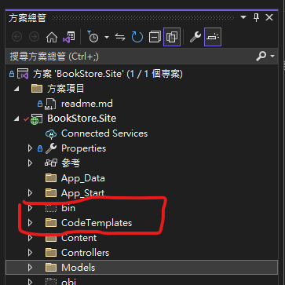
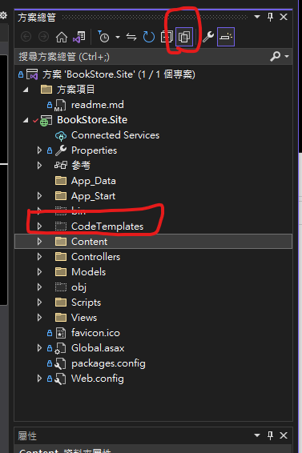

# MVC自訂TEMPLATE

## 已修改項目

1. Create
2. Edit

## 使用步驟

0. 執行 Run.bat

1. 將 CodeTemplates 資料夾加入至專案資料夾根目錄底下

2. 顯示所有檔案, 把 CodeTemplates 內的檔案通通加入專案

3. 重新建置專案

## 修改樣本

* 修改 CodeTemplates\MvcView\{Action}.cs.t4 成自己想要的樣子 e.g. create.cs.t4